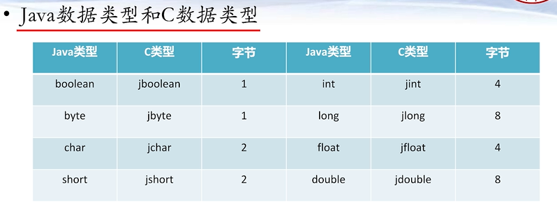

# javaAnd
java高级内容笔记，包含java调用c，python，网络，多线程等重要笔记...
# java调用C代码
 ## 1. 在java文件里声明c文件接口，带上native的标志声明，如下
	public class main.java.JniSample {
	
	//C的调用接口
    public native int sum(int num1,int num2);

    public static void main(String []args){
        System.loadLibrary("main.java.JniSample");
        main.java.JniSample sample=new main.java.JniSample();
        int result=sample.sum(5,7);
        System.out.println("result: "+result);
    }
	}
## 2. 编译运行java程序产生 main.java.JniSample.class文件

## 3. 使用系统环境c盘下的cmd命令，然后切换到JniSample.class所在目录，使用javah命令生成.h文件
	例如： 切换到E:\何旭杰person\IDEA\javaAndc\src>
	输入命令： javah -d ./ main.java.JniSample （./表示输出的文件路径，JniSample表示当前目录下的JniSample文件）
## 4. 接着编写JniSample.c 文件实现方法JNIEXPORT jint JNICALL Java_JniSample_sum(JNIEnv *, jobject, jint, jint);
 如下实现相加运算

	#include"main.java.JniSample.h"
	JNIEXPORT jint JNICALL Java_JniSample_sum
	  (JNIEnv *env, jobject obj, jint num1, jint num2){
    	return num1+num2;
	}

## 4. 使用gcc工具命令生成dll文件，要加入java的jdk文件夹下include的内容，命令如下
	gcc -IE:\Java\jdk1.8.0_121\include -IE:\Java\jdk1.8.0_121\include\main.java.JniSample.C -o main.java.JniSample.dll
	

# java调用python代码
## 1.引人相关的依赖插件jython 2.5.3

    <dependency>
                <groupId>org.python</groupId>
                <artifactId>jython-standalone</artifactId>
                <version>2.5.3</version>
    </dependency>
## 重要类型方法
      PythonInterpreter 对象
      exec              执行语句
      set               设置变量值
      get               获取变量值  
      execfile          执行一个python文件
      PyObject          python对象
      PyFunction        python函数
## 2.开始编写例子
##2.1 Jython 实现java调用python代码
##2.2 Jython2 实现调用运行python文件
##2.3 Jython3 给python文件代码赋值和获取返回值
##2.4 Jython4 java中调用python对象实例的方法
###.5 jJython4 java中调用python中的函数
